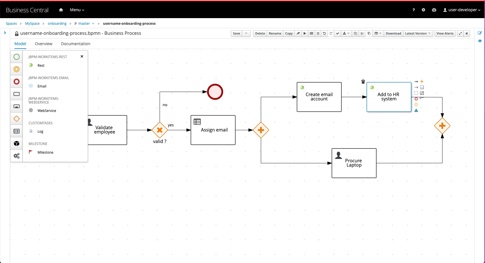
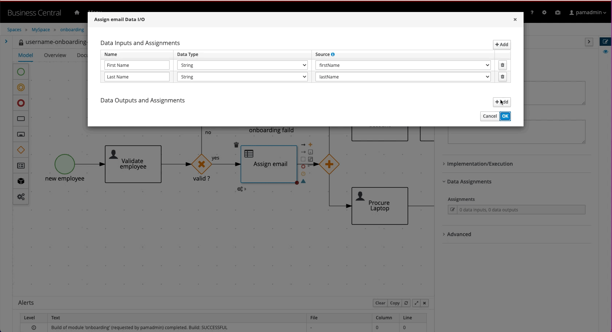

# Process modeling hands-on exercise

Login to Business Central as : 
  - A developer using `username-developer` (change `username` with your id, eg. `m999svs-developer`), or
  - An analyst using `username-analyst` (change `username` with your id, eg. `m999svs-analyst`)

1- Open the **onboarding** project after the login screen

2- Navigate to the **onboarding** project form the **Spaces** screen

3- Add a new business process to the project, name it `username-onboarding-process` (change `username` with your id, eg. `m999svs-onboarding-process`)

4- let's start modeling our process. First, create a **Start Event** and name it `new employee`

5- Create a **User Task** and name it `Validate employee`

6- Create an **Exclusive Gateway** and name it `valid ?`

7- Create a **Business Rule Task** and name it `Assign email`

8- Create an **End Event**, arrange and name the information flows

9- Create a **Parallel Gateway**

10- Select the whole process and move it

11- Add 1x **User Task**, and 2x **Rest Task**

12- Link the tasks, by adding the information flows. Add the closing **Parallel Gateway**

13- Arrange the information flows

14- Name the tasks: `Procure Laptop`, `Create email account`, and `Add to HR system`

15- Arrange the tasks

16- Add an **End Event**, and name it `onboarding succeeded`

17- Name the other **End Event** `onboarding failed`

18- Don't forget to save often !! 

19- Open the process properties on side panel, and add these input **process variables** : 

>  - `firstName` of type `String`
>  - `lastName` of type `String`
>  - `address` of type `String`

  

20- Continue adding these internal **process variables**

>  - `email` of type `String`
>  - `valid` of type `Boolean` 
>  - `laptopProcured` of type `Boolean`

21- Fix `Valid ?` **Exclusive Gateway** routing logic

22- Configure the `Validate employee` **User Task**, click on the task then open the properties on the side panel

23- Add the **input data assignments** to the `Validate employee` **User Task**, using the properties on the side panel

24- On the same task, add the **output data assignments** 

25- lets now configure the  `Assign email` **Business Rule Task** to embed DMN decision logic, click on the task then open the properties on the side panel

26- Add these information from the DMN model to the `Assign email` **Business Rule Task** 

>  - `Namespace` : `https://kiegroup.org/dmn/_D3887DD7-0DE8-4926-9425-13E4D3024A4F`
>  - `Decision Name` : `Email` 
>  - `DMN Model Name` : `email-assignment-rules`

27- Add the **input data assignments** to the `Assign email` **Business Rule Task**, using the properties on the side panel

28- On the same task, add the **output data assignments** 

29- Copy, then paste the `Validate employee` **User Task** 

30- Delete the `Procure Laptop` **User Task**, and replace it with the one you copied, then rename it back to `Procure Laptop`

31- Configure the `Procure Laptop` **User Task**, click on the task then open the properties on the side panel

32- Now let configure the Rest service calls in the `Create email account` **Rest Task**, by adding these parameters

>  - `Method` : `POST`
>  - `Url` : `https://dummy.restapiexample.com/api/v1/create` 

33- Configure the Rest service calls in the `Add to HR system` **Rest Task** , by adding these parameters

>  - `Method` : `POST`
>  - `Url` : `https://dummy.restapiexample.com/api/v1/create` 

34- Generate the **process form** to use for filling input data when starting a new **process instance** in Business Central

35- Open the **process form** and arrange and keep the required input process variables only

Finally, explore the other roles, logout and login as:
  - a manager using `username-manager` (change `username` with your id, eg. `m999svs-manager`), or
  - a user using `username-user` (change `username` with your id, eg. `m999svs-user`)